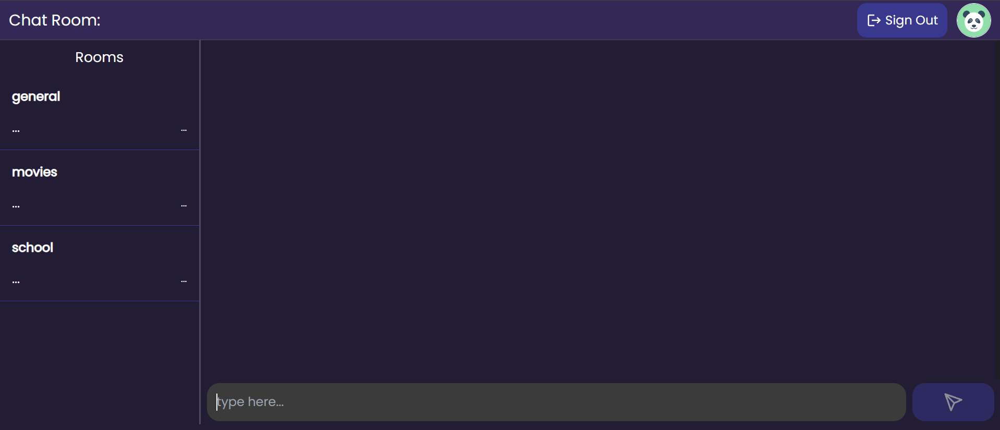

# Reach-Chat-Application

## Description
A real-time chat application enabling users to join rooms, send messages, and interact with others seamlessly. Designed with React and Firebase for dynamic and scalable messaging



## Getting Started
* Fork and clone this repository
* Setup firebase and google auth
* Replace firebase.js file with your firebase config settings
* Make env variables secret on github for showing website updates when code is pushed to github (optional)
* Install packages: ```npm i```
* Run ```npm run dev```

## Helpful Resources
* [Firebase Docs](https://firebase.google.com/docs/web/setup?_gl=1*13xzwsi*_up*MQ..*_ga*MTIwNTk5MzY1MC4xNzIzNzEwMzY3*_ga_CW55HF8NVT*MTcyMzcxMDM2Ny4xLjAuMTcyMzcxMDM2Ny4wLjAuMA..)
* [React Docs](https://react.dev/reference/react/useRef)

## Super Helpful Resources for Github Actions and Firebase
* [GitHub Action for Firebase Docs](https://github.com/marketplace/actions/github-action-for-firebase)
* [Firebase Extended Repo - Extremly Useful](https://github.com/FirebaseExtended/action-hosting-deploy)
* [Firebase Hosting and Github Actions](https://www.youtube.com/watch?v=PUuyqbVtQTQ)
* [Stack Overflow: Env Variables Error](https://stackoverflow.com/questions/66247264/github-actions-how-can-i-make-my-env-variablestored-in-env-file-available-i)
